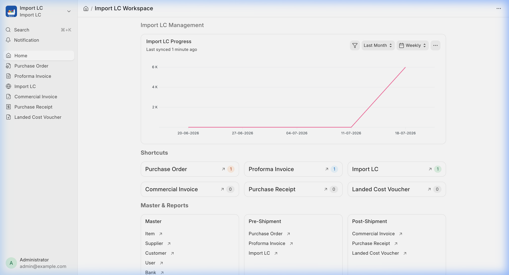
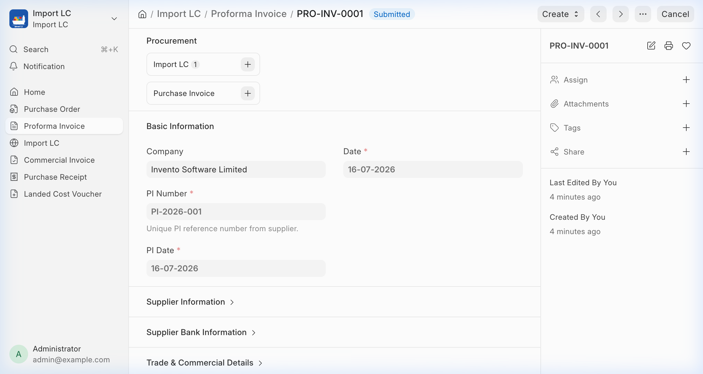
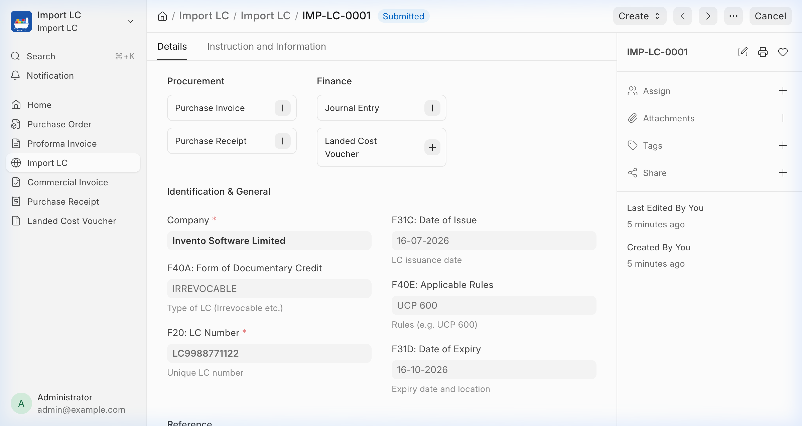

# Import LC

[](https://github.com/invento-software-limited/import-lc/actions/workflows/ci.yml)
[](https://github.com/invento-software-limited/import-lc/actions/workflows/linters.yml)

An Import LC Management app for Frappe and ERPNext (version-16), developed by **Invento Software Limited**.

---

## 📷 Screenshots

### Workspace Dashboard


### Proforma Invoice


### Import LC


---

## 🚀 Features

- **Proforma Invoice (PI) Management**: Track and manage import Proforma Invoices with detail tracking and item mappings.
- **Import LC Tracking**: Create and manage Import Letters of Credit (LC), tracking total values, currencies, issuing banks, beneficiary details, and LC terms.
- **ERPNext Integration**: Integrates smoothly with core ERPNext doctypes to link LCs with import business operations.
- **Custom Dashboards & Workspace**: Visualize Import LC statuses, distributions, and financials directly from the Frappe Desk.

---

## 📋 Prerequisites

Before installing the Import LC app, ensure the following applications are installed on your Frappe Bench:

- **Frappe Framework** (`version-16`)
- **ERPNext** (`version-16`)

---

## 💻 Installation

You can install this app using the [bench](https://github.com/frappe/bench) CLI:

```bash
# Go to your bench directory
cd ~/frappe-bench

# Fetch the app from remote
bench get-app https://github.com/invento-software-limited/import-lc.git --branch version-16

# Install the app on your site
bench --site [your-site-name] install-app import_lc

# Run migrations to apply database changes
bench --site [your-site-name] migrate
```

---

## 🤝 Contributing

This application uses `pre-commit` for code formatting, quality checks, and linter validation.

### Setup Pre-commit locally:
1. [Install pre-commit](https://pre-commit.com/#installation) on your system.
2. Enable pre-commit in this repository:
   ```bash
   cd apps/import_lc
   pre-commit install
   ```

### Configured Tools:
- **Ruff**: For Python linting and formatting.
- **ESLint**: For Javascript code formatting.
- **Prettier**: For formatting JSON, YAML, and CSS files.
- **Semgrep**: For security analysis checks.

---

## 📜 License

MIT License. See the [license.txt](license.txt) file for details.
